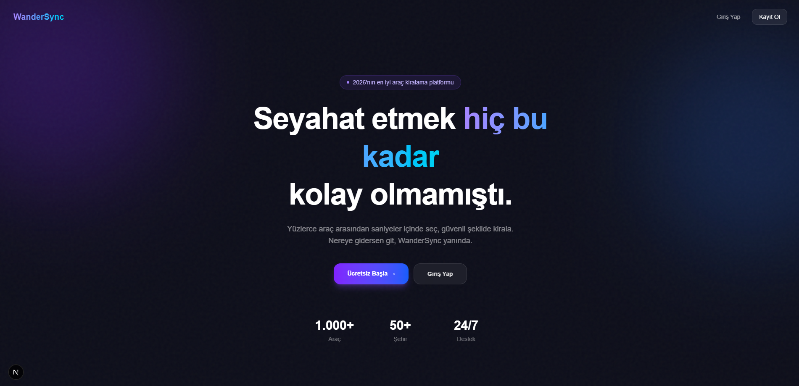
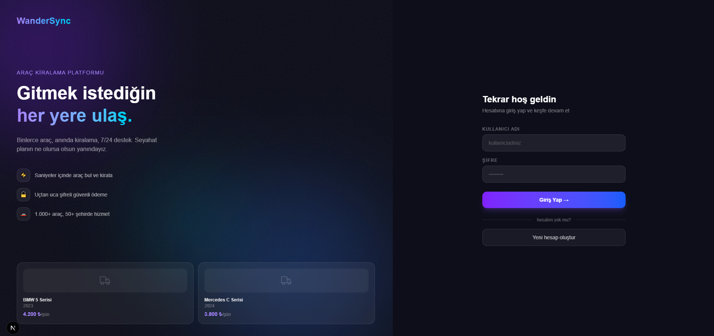
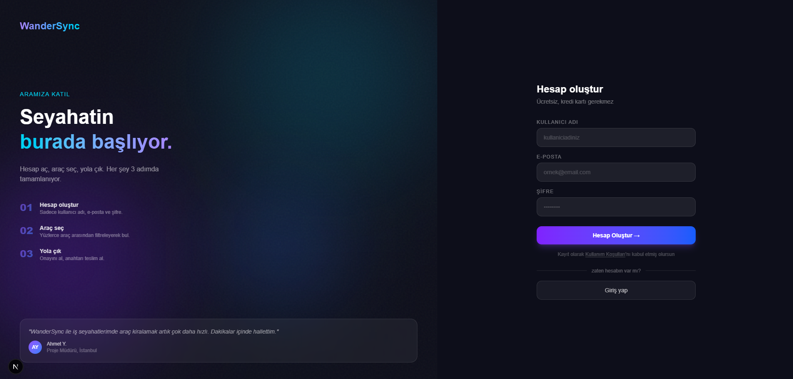

# WanderSync — Enterprise Travel Booking System

> ⚠️ **Bu proje aktif geliştirme aşamasındadır.** Bazı özellikler eksik veya değişkenlik gösterebilir.

.NET 8 mikroservis mimarisi üzerine inşa edilmiş araç kiralama platformu. Clean Architecture, CQRS, Event-Driven Communication ve modern bir Next.js arayüzü içermektedir.

---

## Ekran Görüntüleri

### Anasayfa


### Giriş Ekranı


### Kayıt Ekranı


---

## Mimari

```
EnterpriseTravelBooking/
├── ApiGateway                      # YARP reverse proxy (port 5100)
├── Identity.API                    # Kimlik doğrulama servisi (port 5200)
│   ├── Identity.Domain
│   ├── Identity.Application
│   └── Identity.Infrastructure
├── Catalog.API                     # Araç yönetimi servisi (port 5047)
│   ├── Catalog.Domain
│   ├── Catalog.Application
│   └── Catalog.Infrastructure
├── Rentals.API                     # Kiralama servisi (port 5171)
│   ├── Rentals.Domain
│   ├── Rentals.Application
│   └── Rentals.Infrastructure
├── Notification.Service            # Bildirim servisi (RabbitMQ consumer)
├── EnterpriseTravelBooking.Shared  # Paylaşılan event modelleri
├── client/                         # Next.js 15 web arayüzü (port 3000)
└── docker-compose.yml
```

### Servis İletişim Akışı

```
Tarayıcı (3000)
    │
    ▼
API Gateway (5100) ── YARP Reverse Proxy
    ├──▶ /auth/*     → Identity.API (5200)
    ├──▶ /catalog/*  → Catalog.API  (5047)
    └──▶ /rentals/*  → Rentals.API  (5171)

Catalog.API ──RabbitMQ──▶ Rentals.API          (VehicleCreated / Updated / Deleted)
Rentals.API ──RabbitMQ──▶ Notification.Service  (RentalCreated)
```

---

## Teknoloji Yığını

| Katman | Teknoloji |
|---|---|
| Backend | .NET 8 Web API |
| Kimlik Doğrulama | JWT Bearer, BCrypt |
| Veritabanı | PostgreSQL + Entity Framework Core |
| Mesajlaşma | RabbitMQ + MassTransit |
| Caching | Redis (Distributed Cache) |
| API Gateway | YARP Reverse Proxy |
| CQRS | MediatR + Pipeline Behaviors |
| Validasyon | FluentValidation |
| Loglama | Serilog + Seq |
| Frontend | Next.js 15, TypeScript, Tailwind CSS |
| CI/CD | GitHub Actions |
| Container | Docker Compose |

---

## Özellikler

### ✅ Tamamlanan

#### Identity.API
- JWT token üretimi (Register / Login)
- BCrypt şifre hashleme
- Rol tabanlı yetkilendirme (Admin / User)
- User enumeration saldırısına karşı koruma
- FluentValidation + Global exception handling

#### Catalog.API
- Araç CRUD işlemleri (Admin yetkisi gerekli)
- Sayfalandırmalı araç listeleme
- Redis ile response caching (5 dk sliding expiration)
- Soft delete mekanizması
- RabbitMQ event yayını (VehicleCreated / Updated / Deleted)
- Health check endpoint (`/health`)

#### Rentals.API
- Kiralama oluşturma (JWT korumalı)
- Tarih çakışması kontrolü
- RabbitMQ ile araç verisi senkronizasyonu
- Health check endpoint (`/health`)

#### Notification.Service
- RentalCreated event consumer (MassTransit)

#### API Gateway
- YARP ile tüm servislere tek giriş noktası
- CORS yapılandırması (localhost:3000)

#### CI/CD
- `develop` ve `main` branch'lerine push/PR'da otomatik build + test
- `main`'e merge'de Docker image build

#### Frontend (Next.js 15)
- Aurora glassmorphism tasarım dili
- Split-screen login / register sayfaları
- Araç listeleme: pagination, arama, müsaitlik filtresi
- Loading skeleton animasyonları
- JWT token yönetimi

---

## 🔧 Geliştirme Aşamasındaki Özellikler

- [ ] Cache invalidation — araç kiralandığında Redis cache temizleme
- [ ] Kiralama akışı — frontend'den kiralama yapabilme
- [ ] LLM entegrasyonu — akıllı araç önerisi, doğal dil arama
- [ ] Admin paneli — araç ekleme/düzenleme arayüzü
- [x] Catalog.API — VehicleUpdated / VehicleDeleted event consumer (Rentals tarafında)
- [x] Rentals.API — GetAllRentals endpoint yetkilendirmesi
- [x] Güvenlik iyileştirmeleri (User Secrets geliştirme, environment variables production)
- [ ] Kullanıcı servisi (ayrı mikroservis)
- [x] API Gateway (YARP, port 5100)
- [x] Health check endpoint'leri (`/health`)
- [ ] CI/CD pipeline

---

## Kurulum

### Gereksinimler
- [.NET 8 SDK](https://dotnet.microsoft.com/download)
- [Docker Desktop](https://www.docker.com/products/docker-desktop)
- [Node.js 18+](https://nodejs.org)

### 1. Ortam değişkenlerini hazırla

```bash
cp .env.example .env
# .env dosyasını düzenle ve şifreleri doldur
```

### 2. Altyapıyı başlat

```bash
docker-compose up -d
# PostgreSQL, RabbitMQ, Redis, Seq ayağa kalkar
```

### 3. Backend servislerini çalıştır

```bash
dotnet run --project ApiGateway
dotnet run --project Identity.API
dotnet run --project Catalog.API
dotnet run --project Rentals.API
dotnet run --project Notification.Service
```

### 4. Frontend'i çalıştır

```bash
cd client
npm install
npm run dev
```

Uygulama: `http://localhost:3000`

---

### Geliştirici Araçları

| Araç | Adres |
|---|---|
| Seq (Log arayüzü) | http://localhost:5341 |
| RabbitMQ Yönetim | http://localhost:15672 |
| Swagger — Identity | http://localhost:5200/swagger |
| Swagger — Catalog | http://localhost:5047/swagger |
| Swagger — Rentals | http://localhost:5171/swagger |

---

## Proje Durumu

Bu proje bir öğrenme ve portföy projesidir. Gerçek dünya mikroservis mimarisini, event-driven communication'ı ve modern frontend geliştirmeyi bir arada göstermek amacıyla geliştirilmektedir.
